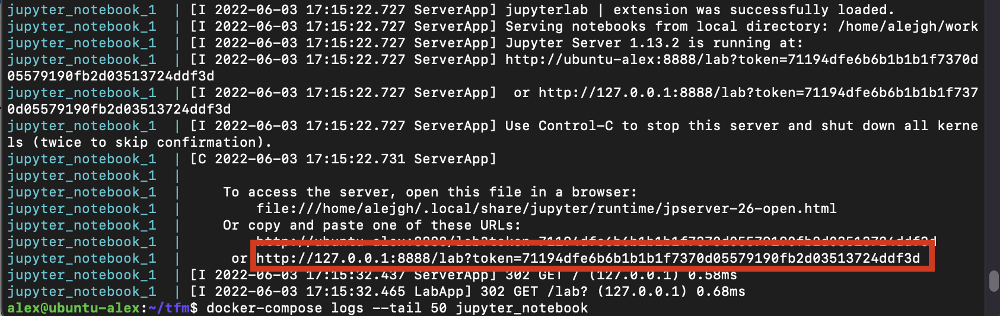

# Type prediction in Wikidata using its edit history
This code is part of the paper "Leveraging Wikidata's edit history in knowledge graph refinement tasks". The main purpose of this paper is using edit history information from Wikidata to perform type prediction tasks. There are several elements in this codebase used to:
- Fetch edit history information from Wikidata and index it into a MongoDB database.
- Analyze the edit history information from the database.
- Create and evaluate type prediction models using this edit history information.

It is recommended to have read the paper before executing the code within this repository.

## Directory layout
- [config](./config): Files used by the docker containers to set up MongoDB databases and configuration.
- [data](./data): Data used by the notebooks and edit history fetching scripts.
- [notebooks](./notebooks): Notebooks where the main experiments from the paper were conducted.
- [scripts](./scripts): Scripts used to fetch the edit history information from Wikidata, convert it into JSON diffs, and index those diffs into MongoDB.

Each folder contains a README file with additional information about its contents.


## Running the experiments
### System requirements
In order to run the code it is needed to have at least 400GB of free disk space to store the edit history dataset and 20GB of RAM to train the type prediction models. Additional RAM and disk I/O speed can greatly increase the performance of queries to MongoDB.

### Using Docker
We provide Docker containers to recreate all the necessary dependencies needed to run the experiments. This is the preferred option to reproduce the experiments, since it only requires a working [Docker](https://docs.docker.com/engine/install/) installation.

Before running the containers, it is necessary to configure the users and passwords of the MongoDB and Jupyter notebook containers. **We provide an *.env-sample* file that should be renamed to *.env*, where we can modify the containers configuration**.

There are two main docker-compose files provided in this repository:
- docker-compose-notebook.yml: This file includes a MongoDB container used to store the edit history information and runs a Jupyter Notebook server with all the required dependencies to run the experiments.
- docker-compose-fetching.yml: This file includes a container that fetches the edit history information from Wikidata and index it into a MongoDB instance. It also includes the MongoDB and Jupyter Notebook containers.

#### Option A: Reusing the edit history dataset
In this first option, we load an exported version of the edit history dataset into the MongoDB container, saving the time needed to fetch the edit history information and computing the diff of each revision.

The main steps to run the code using this way are:
1. Download the exported edit history dataset from [here]().
2. Set up the user and password needed to access the MongoDB instance in the *.env-sample* file, and rename this file to *.env*. 
3. Run the docker-compose.yml file to start up the MongoDB and Jupyter Notebook server.
4. Load the exported dataset into MongoDB.

5. Access the Jupyter Notebook server through the following url. To do so, we need to first run the command ```docker-compose logs --tail 50 jupyter_notebook``` to see the token needed to access the server. This is highlighted in the following image:

    

    If we now go to the http://127.0.0.1:8888/lab?token=xxx address (replace with your token) we will access the Jupyter Notebook server.
5. Now everything is set up to start reproducing the experiments.
6. When we have finished running the notebooks we can use the command ```docker-compose down``` to stop the containers.

You can visit the [notebooks](./notebooks/) folder for more information about the contents of each notebook.

#### Option B: Fetching edit data from scratch
In this second option, instead of importing the edit history dataset into MongoDB we will fetch it directly from Wikidata and compute the diffs of each revision.

> This option is not recommended, since fetching the edit history information from Wikidata may take a long time (~15 days). 

The main steps to run the code are:
1. a
2. b
3. During this time, you can use the ```docker-compose logs``` command to see the current status of the revision

### Manually running the code
It is also possible to manually install all the required dependencies to run the code. We have used Python 3.8 in the experiments, and all the required libraries are available in this [requirements.txt](./notebooks/requirements.txt) file. Additionally, we have used Rust 1.5.8 for the indexing code and version 4.4 of MongoDB.

There is also the option to fetch the revision story from scratch by running the provided scripts or instead importing the dataset directly into MongoDB. The steps needed to perform those options are analogous to the ones explained in the Docker section.

## Using the type prediction models
The models trained during the paper are available through the [following link](). Each unsupervised model consists of a *model.pkl* file which can be imported using torch as follows:
```python
with open(MODEL_FILE_PATH, 'rb') as f:
    model = torch.load(f, map_location=torch.device('cpu'))
```

If we have CUDA available, we can replace the 'cpu' device by 'CUDA'.

In order to get tail or head predictions for a triple, we can use the pykeen library as follows:
```python
from pykeen.models import predict

entity = "http://www.wikidata.org/entity/Q42"
prop = "http://www.wikidata.org/prop/direct/P31"
pred_df = predict.get_tail_prediction_df(model, entity, prop, triples_factory=triples_factory, add_novelties=False)
```

This will return a pandas dataframe containing the ranked results.

> Currently, the triples_factory variable needs to be created manually by loading the RDF dataset used to train the models. There is an example in [notebook 4_Model_Evaluation.ipynb](./notebooks/4_Model_Evaluation.ipynb) where this variable is created.


## License
Copyright (c) 2022 Alejandro González Hevia. This code is licensed under the [MIT license](LICENSE).